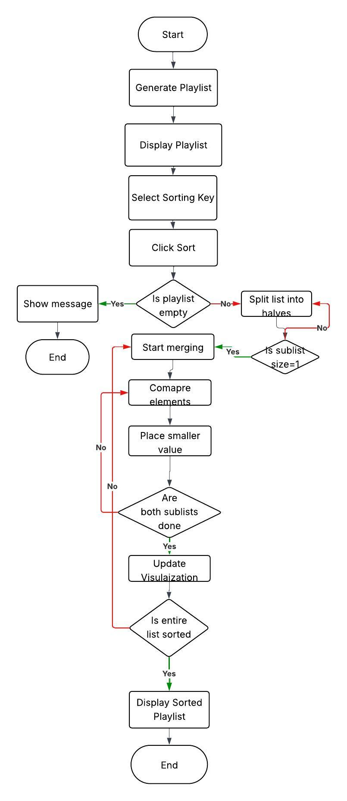

# Algorithm Name
Playlist Vibe Builder
## Chosen Problem (1-2 sentences) 
The chosen problem is the Playlist Vibe Builder, where the user is given a list of songs, each with a title, artist, energy score, and duration. The goal is to sort this playlist based on a selected attribute, such as energy or duration, while visually showing how the order changes step by step through the sorting process.
## Demo video/gif/screenshot of test
[Demo Video](https://drive.google.com/file/d/17U-lrV2EG3mx1tbaqoA78akSYGVKKuWK/view?usp=sharing)

## Problem Breakdown & Computational Thinking
## Flowchart

I chose Merge Sort for this project because it works really well with my playlist data and makes the sorting process easier to understand when shown step by step. The playlist is a list of songs, where each song has a title, artist, energy score, and duration. Since energy and duration are numbers, Merge Sort can compare them directly and sort them efficiently. It also always runs in O(n log n) time, so it is reliable no matter how the playlist starts. Another reason I picked it is because it is stable, so if two songs have the same energy or duration, they stay in the same order they were originally in, which makes sense for a playlist.

There are a few basic conditions needed for the algorithm to work properly, but nothing complicated. The data does not need to be sorted beforehand, which is helpful because the playlist can start in any random order. However, the playlist cannot be empty, and each song needs to have valid numeric values for energy and duration. The user also has to choose what they want to sort by before starting. My app handles this by not allowing the sort to run if there are no songs and by checking that each line of input follows the correct format. It also checks that energy is between 0 and 100 and that duration is greater than 0.

During the simulation, the user sees the playlist as bars on the screen in the browser. The height of each bar represents either the energy or the duration depending on what was chosen. As the algorithm runs, the app shows the sorting process one step at a time. Bars involved in comparisons are highlighted in one color, while bars that have just been placed into position are shown in another color. The user can move through the process step by step, which makes it easier to follow how Merge Sort compares values and rebuilds the playlist in sorted order. The final sorted playlist is also shown clearly in text form.

I chose this approach because the Playlist Vibe Builder is something people can easily relate to, like organizing music based on mood or length. Merge Sort fits this really well because it is easier to understand and visualize compared to something like Quick Sort. The way it splits and then merges the list makes it much clearer to show on screen. This helped me create something that not only works but also shows how the algorithm works in a way that is easy to understand.

Decomposition in my project means breaking Merge Sort into simple steps. First, the playlist is split into smaller halves over and over until each part has only one song. Then those small parts are merged back together while comparing their values based on energy or duration. During merging, the smaller value is placed first, and this continues until the whole playlist is sorted.

Pattern recognition comes from how the same actions repeat. The algorithm keeps splitting the list and then comparing values when merging. It always checks which value is smaller and places it in order, and this comparison process happens again and again throughout the sort.

Abstraction in my app means only showing what actually helps the user understand what is going on. The user will see bars representing songs, their heights, and how they change during sorting. They will also see colors showing which songs are being compared or placed. Things like recursion, indexes, and how the data is stored internally are not shown because they are not needed for understanding the visual.

Algorithm design follows a simple input, process, and output flow using the GUI. The input is when the user enters playlist data into the textbox or loads sample data, then chooses whether to sort by energy or duration. The process is the Merge Sort running step by step while preparing the visual changes. The output is the step-by-step visualization and the final ordered playlist. The data is stored as a list of dictionaries where each dictionary represents a song.

## Steps to Run
1. Open the app in your browser (or run the file and open the Gradio link).
2. Enter your songs in the input box using the format title,artist,energy,duration or click Load Sample Playlist.
3. Choose whether to sort by energy or duration.
4. Click Prepare Merge Sort to generate the steps.
5. Use Next Step and Previous Step to go through the sorting, or click Auto Play to watch it automatically.
6. View the final sorted playlist at the bottom.
7. Click Clear if you want to reset and try again.

## Hugging Face Link
https://huggingface.co/spaces/saida-17001/Playlist-Vibe-Builder

## Testing (what you tried + edge cases)
[Testing Video](https://drive.google.com/file/d/17U-lrV2EG3mx1tbaqoA78akSYGVKKuWK/view?usp=sharing)
I tested the app using multiple different inputs to make sure it works correctly. I tested sorting by energy and duration and confirmed that the playlist was ordered correctly in both cases. I also tested edge cases such as negative energy values, empty input, and a playlist with only one song, and the app handled these cases by showing appropriate error messages or correct output. I recorded a video demonstrating these test cases and included it above as evidence. This is all included in my screenrecord.

## Author & AI Acknowledgment
AI use (Level 4): Chatgpt AI was used to help understand concepts, help with structure, and debug errors while building the app.
